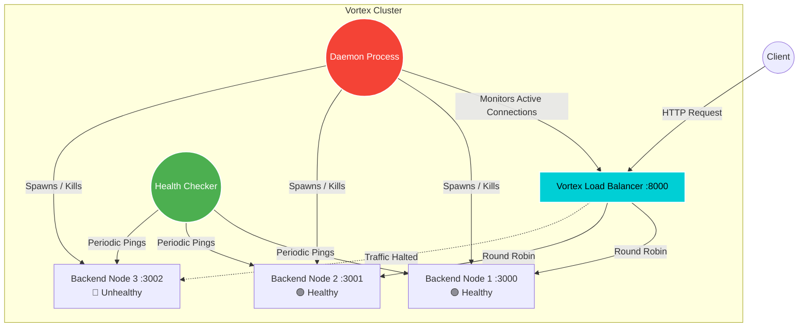

<div align="center">
  
  
  # 🌀 Vortex Load Balancer
  
  **A Dynamic, Auto-Scaling Reverse Proxy & Cluster Manager built in Go.**
  
  [](https://golang.org/)
  [](https://gin-gonic.com/)
  [](https://opensource.org/licenses/MIT)
  [](http://makeapullrequest.com)

  <p align="center">
    <a href="#-features">Features</a> •
    <a href="#-architecture">Architecture</a> •
    <a href="#-getting-started">Getting Started</a> •
    <a href="#-configuration">Configuration</a> •
    <a href="#-dashboard-beta">Dashboard</a>
  </p>
</div>

---

## 🚀 Features

* **⚡ Dynamic Auto-Scaling:** A background daemon intelligently spawns or terminates backend nodes on the fly based on real-time active connection loads.
* **⚖️ Algorithmic Load Balancing:** Uses a Round-Robin strategy to efficiently and evenly distribute incoming traffic across the matrix of healthy backend servers.
* **🩺 Automated Health Checks:** Periodically sweeps through nodes to identify failures. Unhealthy nodes are instantly sidelined and re-introduced only upon recovery.
* **⚙️ Declarative Configuration:** Easily tweak scale-up margins, port ranges, and replica ceilings via a simple, readable `vortex.yaml` file.
* **📊 Real-time Dashboard:** A built-in metrics UI to seamlessly visualize active connections, node health, and request routing.
* **📈 Enterprise Observability:** Integrated Prometheus metric scraping Endpoint and complete Grafana telemetry stack out-of-the-box.

---

## 🏗 Architecture

Vortex operates via two primary sub-systems intricately tied together:

1. **The Load Balancer Engine (`lb.go`)**: Acts as the traffic cop. It routes incoming requests and monitors the pulse of the current node fleet (active connections and health).
2. **The Daemon (`demon.go`)**: A background watcher process that handles the horizontal scaling of the node fleet based on connection thresholds.



---

## 🛠 Getting Started

### Prerequisites
* Go 1.20 or newer installed on your machine.

### Installation (Local)

1. **Clone the repository:**
   ```bash
   git clone https://github.com/NKS01X/vortex.yaml
   cd vortex
   ```

2. **Install Dependencies:**
   Vortex utilizes `gin-gonic` and `yaml.v3` for routing and configuration mapping.
   ```bash
   go mod download
   ```

3. **Fire up the Cluster:**
   Ensure `vortex.yaml` is present in the root directory.
   ```bash
   go run main.go
   ```
   > You will see the Load Balancer spinning up on port `:8000` and backend nodes starting sequentially from `:3000` (or as configured).

### Production Ready (Docker & Observability)

To make Vortex production-ready, it comes with a `Dockerfile` and a `docker-compose.yml` to seamlessly orchestrate the load balancer into an isolated network alongside Prometheus and Grafana.

**Spin up the entire stack seamlessly** using Docker Compose:
```bash
docker compose up -d --build
```
This automatically boots up:
* **Vortex Load Balancer**: `http://localhost:8000`
* **Grafana Web UI**: `http://localhost:3000` *(Pre-loaded with the **Vortex Overview** dashboard)*
* **Prometheus Metrics**: `http://localhost:9090`

Alternatively, build and run just the standalone load balancer using **Make**:
```bash
make docker-run
```
Alternatively, build manually using Docker:
```bash
docker build -t vortex-lb:latest .
docker run -p 8000:8000 --rm vortex-lb:latest
```

### Testing the Load Balancer

Send a simple cURL request to hit the Vortex engine:
```bash
curl http://localhost:8000/
```
You should expect a response like:
```text
🌀 Vortex Node spinning on Port: 3000
```
_Subsequent requests will hit `:3001`, `:3002`, and so forth, portraying the algorithmic Round-Robin load distribution._

---

## 🎛 Configuration (`vortex.yaml`)

Your cluster limits and triggers are shaped entirely by `vortex.yaml`. 

```yaml
cluster:
  min_replicas: 2           # Minimum backend nodes the cluster should start with
  max_replicas: 5           # Scale ceiling: maximum concurrent nodes allowed
  starting_port: 3000       # The base port where node generation begins

settings:
  scaleupnumber: 5          # Number of active connections required to spawn a new server
  scaledownnumber: 2        # The minimum threshold to trim redundant servers
```

---

## 📊 Dashboard (Beta)

Vortex comes natively equipped with a built-in dashboard handler mechanism in `main.go`. When mapped, it provides a gorgeous, 2-second refreshing metric readout of your entire cluster landscape.

*Displays:*
* Number of **Active Connections**
* List of **Backend Nodes** IPs & Ports
* **Health Status** (Online/Offline)
* **Total Requests Handled** per Node

### 📈 Grafana Analytics
In addition to the native built-in dashboard, running the project via `docker compose` spins up a fully provisioned Grafana instance. The **Vortex Overview** Grafana Dashboard is configured out-of-the-box and automatically loaded, providing extensive metric visualizations for:
* **Traffic Throughput (RPS)**
* **Error Rates (5xx)**
* **Active Cluster Size**

---

## 🤝 Contributing

Contributions, issues, and feature requests are welcome! 
Feel free to check out the [issues page](../../issues).

1. Fork the Project
2. Create your Feature Branch (`git checkout -b feature/AmazingFeature`)
3. Commit your Changes (`git commit -m 'Add some AmazingFeature'`)
4. Push to the Branch (`git push origin feature/AmazingFeature`)
5. Open a Pull Request

---

<div align="center">
  <p>Built with ⚡ & ❤️ by <a href="https://github.com/NKS01X"><b>Nikhil</b></a></p>
</div>
