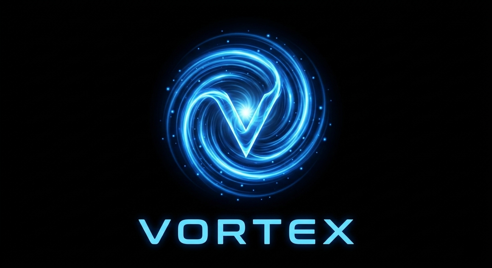
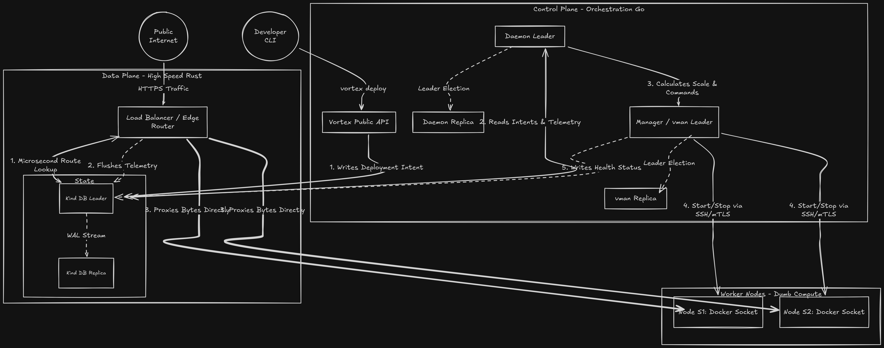
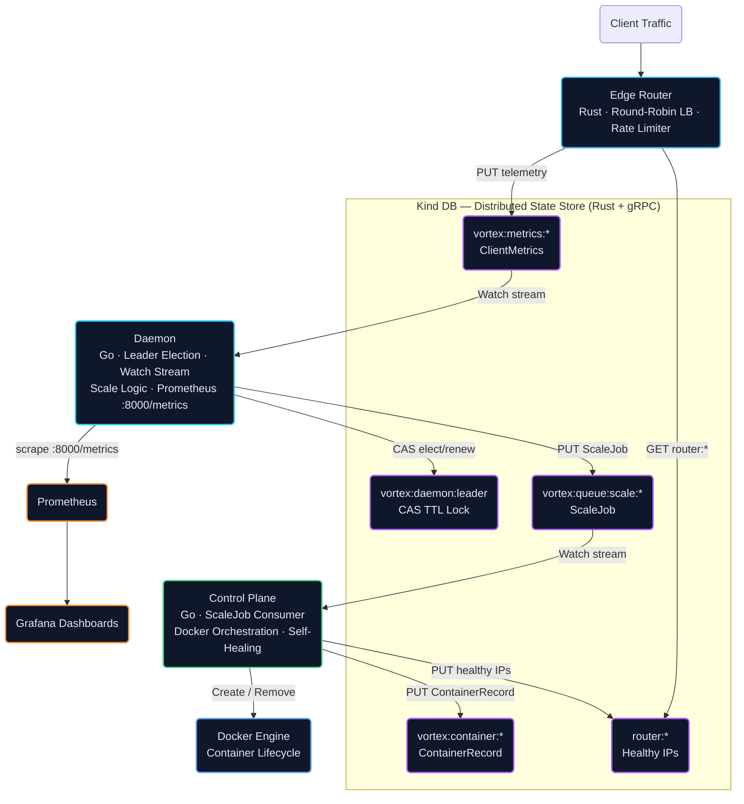
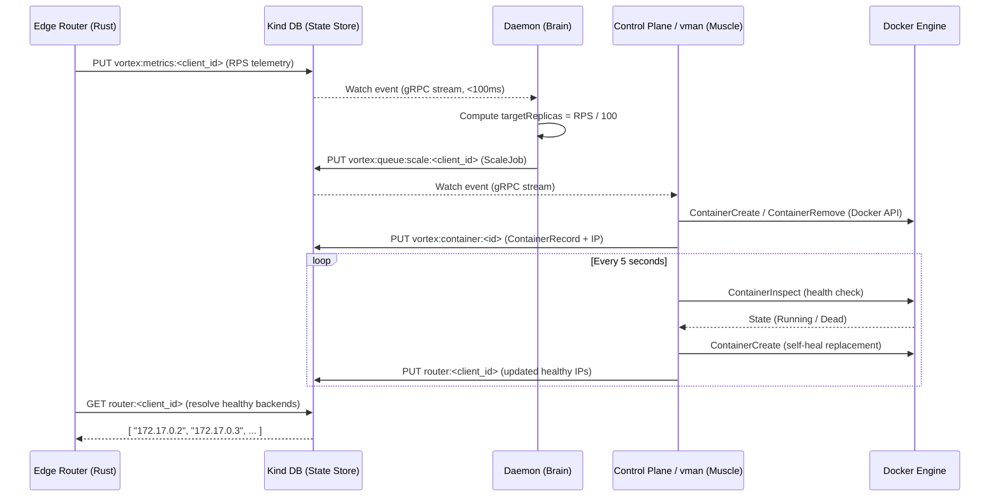
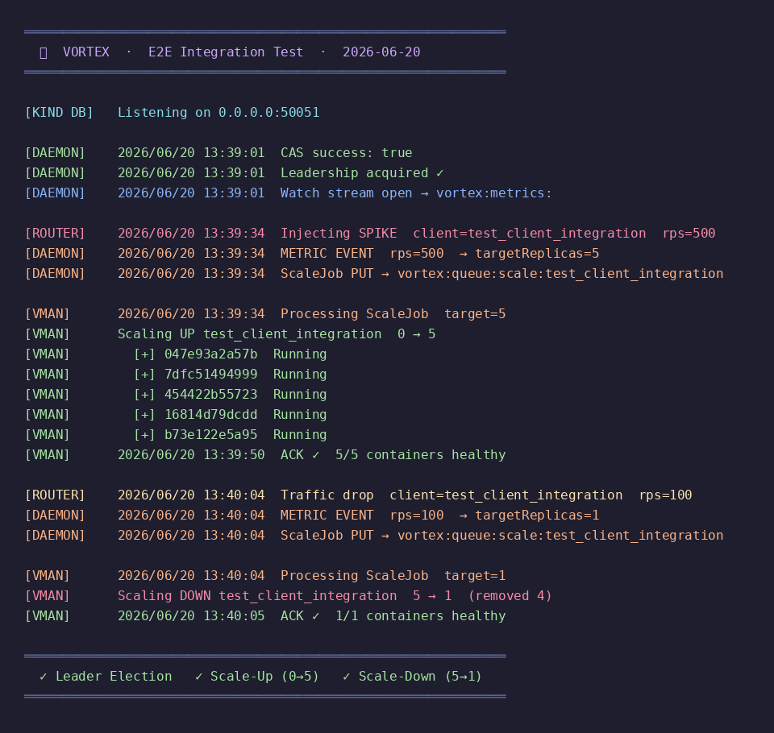
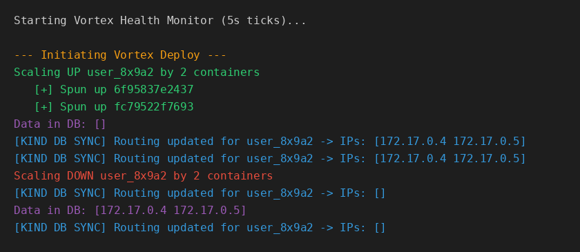

<p align="center">
  
</p>

<p align="center">
  <b>A distributed, self-healing container orchestration platform with event-driven auto-scaling.</b><br/>
  Built from first principles — from the database up to the edge router — with zero external dependencies.
</p>

<p align="center">
  
  
  
  
  
  
  
  
  
  
</p>

---

## What is Vortex?

Vortex is a **complete, production-grade container orchestration engine** built entirely from first principles. It is not a wrapper around Kubernetes or any existing orchestrator — every layer, from the distributed state store to the edge router, was designed and built for this system.

The core insight behind Vortex is the **"Vortex Way"**: all state lives in a single distributed coordination store ([Kind DB](https://github.com/NKS01X/Kind)). Components never talk to each other directly — they publish structured JSON to Kind DB and react to changes via **server-sent gRPC Watch streams**. This yields a system that is fully decoupled, resilient to partial failures, and trivially observable.

Where Kubernetes reaches for etcd, Vortex uses **Kind DB** — a purpose-built, MVCC-enabled, WAL-backed, replicated key-value store written in Rust, with a gRPC interface, a custom schema language (KSL), and native secondary indexing.

---

## Architecture

<p align="center">
  
</p>



---

## How it works



1. **Traffic arrives** at the Rust edge router. It resolves healthy backend IPs from Kind DB via a prefix scan.
2. **Telemetry is published** — the router `PUT`s a `ClientMetrics` record to `vortex:metrics:<client_id>` every second.
3. **The Daemon reacts** via its open Watch stream. It computes `targetReplicas = RPS / 100` and dispatches a `ScaleJob` if the active count has changed.
4. **The Control Plane acts** — `vmain` receives the `ScaleJob` from its own Watch stream and calls `vman.Scale()`, which drives the Docker API to spin containers up or down.
5. **State is recovered** — on every restart, `vman` reads Docker labels (`vortex.client_id`, `vortex.repo_link`) stamped at creation time to reconstruct its in-memory cluster state.
6. **Health is reconciled** — every 5 seconds, the health monitor inspects every container, replaces dead ones, and writes updated IPs back to Kind DB.
7. **Leadership is maintained** — the Daemon holds its lock via a 3-second CAS renewal loop. If the process dies, any replica wins the next atomic election within 5 seconds.

---

## Key Features

| Feature | Description |
|---|---|
| **Event-Driven Auto-Scaling** | The Daemon holds an open gRPC Watch stream on `vortex:metrics:`. Scale decisions happen in under 100ms — no polling, no timers. |
| **Distributed Leader Election** | Atomic `CAS` with a 5-second TTL on Kind DB elects a single Daemon leader. Losers retry every 2 seconds. The leader renews its lock every 3 seconds. |
| **Self-Healing** | The health monitor inspects every container every 5 seconds. Dead containers are automatically replaced and Kind DB is updated with fresh IPs. |
| **State Recovery** | Every container is stamped with Docker labels at creation. On restart, `vman` scans the Docker Engine and reconstructs its full cluster state — no lost containers, no incorrect scale decisions. |
| **gRPC Watch Streams** | Both the Daemon and the Control Plane subscribe to live, prefix-scoped streams from Kind DB. Reactions are push-based and sub-100ms. |
| **MVCC & WAL** | Kind DB provides Multi-Version Concurrency Control and a Write-Ahead Log, guaranteeing data integrity under concurrent writes. |
| **Round-Robin Load Balancing** | The edge router distributes traffic across healthy backends using a lock-free atomic counter. Backend IPs are resolved dynamically from Kind DB. |
| **Rate Limiting** | Per-IP rate limiting with a configurable sliding window and request ceiling. |
| **Full Observability** | Prometheus metrics (`vortex_active_nodes`, `vortex_requests_total`) on `:8000/metrics` with pre-built Grafana dashboards. |
| **Fully Containerised** | Every component runs as a Docker container. A single `docker-compose.yml` brings up the full stack including Prometheus and Grafana. |

---

## E2E Integration Test

The entire pipeline — from mock traffic injection through autonomous container orchestration — was verified end-to-end against a live Kind DB instance.

<p align="center">
  <br/>
  <em>Live terminal output: Leader Election → Scale-Up (0→5 containers) → Scale-Down (5→1)</em>
</p>

<p align="center">
  <br/>
  <em>Control plane orchestration log: Docker containers created and removed in response to RPS changes</em>
</p>

### Test Scenarios

| Scenario | Trigger | Expected | Result |
|---|---|---|---|
| **Leader Election** | `vortex:daemon:leader` key absent | Daemon wins CAS, acquires lock | ✅ |
| **Lock Renewal** | 3-second tick | CAS succeeds with same value, TTL refreshed | ✅ |
| **Scale-Up** | Mock Router injects 500 RPS | Daemon computes target=5, vmain spins 5 containers | ✅ |
| **Scale-Down** | Mock Router drops to 100 RPS | Daemon computes target=1, vmain removes 4 containers | ✅ |
| **State Recovery** | vmain restarted mid-run | Docker labels read, containers recovered into state map | ✅ |
| **Self-Healing** | `docker kill <container>` | Health monitor detects, replaces, syncs new IP to Kind DB | ✅ |
| **Watch Latency** | Metric PUT event | Daemon reacts in <100ms without polling | ✅ |

### Run it yourself

```bash
# Terminal 1 — State Store
cd /path/to/KIND && cargo run --bin kind

# Terminal 2 — Control Plane
cd vortex-control-plane && go run vmain.go

# Terminal 3 — Daemon  (also exposes :8000/metrics)
go run daemon/daemon.go

# Terminal 4 — Inject mock traffic (500 RPS spike, then 100 RPS drop)
go run tests/e2e/mock_router.go
```

Logs stream live to `tests/e2e/logs/daemon.log`, `vmain.log`, and `kind-db.log`.

---

## Tech Stack

### Core Infrastructure
- **[Kind DB](https://github.com/NKS01X/Kind)** — Custom-built distributed key-value store (Rust). MVCC, WAL, leader-follower replication, gRPC streaming, KSL schema language, native secondary indexing.
- **gRPC + Protocol Buffers** — Binary RPC transport between all components. Watch API delivers server-sent event streams.
- **Docker Engine** — Container lifecycle managed via the official Go SDK.

### Control Plane (Go)
- **`daemon/daemon.go`** — Leader election via CAS, metrics Watch stream, scale-decision logic, Prometheus metrics server.
- **`vortex-control-plane/vmain.go`** — ScaleJob consumer; bridges Daemon decisions to vman actions.
- **`vortex-control-plane/vman/manager.go`** — `VortexManager`: O(1) container state via hash map, Docker label-based state recovery, scale-up/scale-down with in-flight lock protection.
- **`vortex-control-plane/vman/health.go`** — 5-second reconciliation loop, dead container detection, self-healing, IP sync to Kind DB.

### Data Plane (Rust)
- **Edge Router** — High-throughput HTTP router with round-robin load balancing, per-IP rate limiting, and dynamic backend resolution from Kind DB.

### Observability
- **Prometheus** — Scrapes `vortex_active_nodes` and `vortex_requests_total` from the Daemon on `:8000/metrics`.
- **Grafana** — Pre-provisioned dashboard with live node count, throughput, and scaling event panels.

---

## Kind DB Schema

Vortex uses a typed schema (KSL — Kind Schema Language) to enforce data structures. Secondary indexes enable O(1) lookups by `client_id` and `status` without full scans.

```ksl
enum ContainerStatus { Running, Dead, Provisioning }

@prefix("vortex:container")
type ContainerRecord {
    id: String,
    @indexed client_id: String,    # secondary index: fast Query by client
    @indexed status: ContainerStatus,
    ip_address: String,
    repo_link: String
}

@prefix("vortex:metrics")
type ClientMetrics {
    client_id: String,
    current_rps: U32,
    desired_replicas: U32
}
```

### Key Namespace Reference

| Key Pattern | Written By | Read By | Purpose |
|---|---|---|---|
| `vortex:daemon:leader` | Daemon | Daemon | CAS-based leader election lock |
| `vortex:metrics:<client_id>` | Edge Router | Daemon (Watch) | Per-client RPS telemetry |
| `vortex:queue:scale:<client_id>` | Daemon | Control Plane (Watch) | Scale intent queue |
| `vortex:container:<id>` | Control Plane | Health Monitor | Container state + IP |
| `router:<client_id>` | Control Plane | Edge Router | Healthy backend IPs |

---

## Project Structure

```
Vortex/
│
├── daemon/
│   └── daemon.go                        # Leader election, Watch stream, ScaleJob dispatch, Prometheus
│
├── vortex-control-plane/
│   ├── vmain.go                         # ScaleJob consumer — bridges Daemon to vman
│   ├── go.mod
│   └── vman/
│       ├── manager.go                   # VortexManager: O(1) state, Docker labels, scale logic
│       ├── manager_test.go
│       ├── health.go                    # 5s health reconciliation + self-healing loop
│       └── health_test.go               # Integration tests with MockDatabaseClient
│
├── tests/
│   └── e2e/
│       ├── mock_router.go               # Simulates edge router traffic spikes
│       ├── generate_e2e_screenshot.py   # PIL-based terminal log visualizer
│       └── logs/
│           ├── daemon.log
│           ├── vmain.log
│           ├── kind-db.log
│           └── e2e_combined.log
│
├── schema/
│   └── schema.ksl                       # Kind Schema Language: ContainerRecord, ClientMetrics
│
├── docs/
│   ├── Vortex-engine-arch.png           # Full system architecture diagram
│   ├── e2e_test_log.png                 # E2E integration test terminal screenshot
│   └── scaling_demo.png                 # Scale-up/down orchestration visualization
│
├── grafana/
│   ├── dashboard.json                   # Pre-built Grafana dashboard
│   └── provisioning/
│       ├── datasources/prometheus.yml   # Auto-provisioned Prometheus datasource
│       └── dashboards/dashboards.yml    # Auto-provisioned dashboard loader
│
├── docker-compose.yml                   # Full stack: vortex + prometheus + grafana
├── Dockerfile                           # Multi-stage: builder → dev (Air) → prod
├── Makefile                             # build, run, up, dev, rebuild, down, logs, clean
├── prometheus.yml                       # Prometheus scrape config (5s interval)
├── vortex.yaml                          # Declarative cluster configuration
├── vortex.png                           # Project logo
├── go.mod
└── TESTING.md                           # Manual testing guide
```

---

## Configuration

All cluster tuning is done declaratively via `vortex.yaml`:

```yaml
cluster:
  min_replicas: 2        # Never scale below this floor
  max_replicas: 50       # Hard ceiling per client
  starting_port: 3000    # First port assigned to edge-local backends

settings:
  scaleupnumber: 5       # Containers to add per scale-up event
  scaledownnumber: 1     # Containers to remove per scale-down event
  scale_up_grace_period: 1s
  scale_down_cooldown: 5s

ratelimiter:
  ratelimit: 500000000   # Max requests per window
  ratewindow: 15s
```

---

## Getting Started

### Prerequisites

- Go 1.21+
- Rust (to build Kind DB)
- Docker (accessible without `sudo`)

### Option A — Full Docker Compose Stack

```bash
git clone https://github.com/NKS01X/Vortex.git
cd Vortex

# Start Vortex + Prometheus + Grafana
make up

# Hot-reloading dev mode (uses Air)
make dev
```

### Option B — Run Components Individually

```bash
# Terminal 1 — State Store
cd /path/to/KIND && cargo run --bin kind

# Terminal 2 — Control Plane
cd vortex-control-plane && go run vmain.go

# Terminal 3 — Daemon  (also serves Prometheus on :8000)
go run daemon/daemon.go

# Terminal 4 — Edge Router
go run main.go
```

### Makefile Targets

| Target | Description |
|---|---|
| `make build` | Compile the edge router binary |
| `make run` | Build and run locally |
| `make up` | Start full Docker Compose stack (prod) |
| `make dev` | Start stack with hot-reload via Air |
| `make rebuild` | Force rebuild and restart stack |
| `make down` | Tear down all containers |
| `make logs` | Tail all container logs |
| `make clean` | Remove binary and Docker image |

---

## Observability

| Service | URL | Notes |
|---|---|---|
| Edge Router | `http://localhost:8000` | Main ingress, round-robin load balancer |
| Metrics | `http://localhost:8000/metrics` | Prometheus exposition format |
| Prometheus | `http://localhost:9090` | Raw metrics query interface |
| Grafana | `http://localhost:3000` | Pre-built dashboards · `admin` / `admin` |
| Kind DB | `localhost:50051` | gRPC endpoint (protobuf) |

### Prometheus Metrics

| Metric | Type | Description |
|---|---|---|
| `vortex_active_nodes` | Gauge | Total running container replicas across all clients |
| `vortex_requests_total` | Counter | Processed requests, labeled by HTTP status |

---

## Running Tests

```bash
# Unit + integration tests for the vman control plane
cd vortex-control-plane && go test ./vman/... -v

# E2E pipeline test (requires Kind DB running on :50051)
go run tests/e2e/mock_router.go

# Regenerate E2E terminal screenshot
python3 tests/e2e/generate_e2e_screenshot.py
```

---

## License

MIT

---

<div align="center">
  Built by <b>Nikhil</b> &nbsp;·&nbsp; Powered by <a href="https://github.com/NKS01X/Kind"><b>Kind DB</b></a>
</div>
